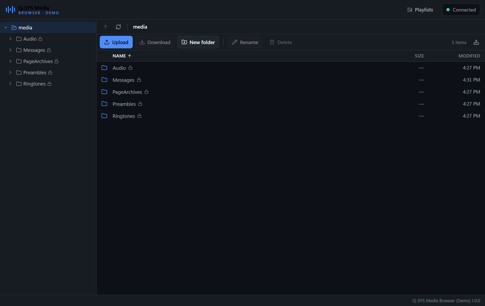
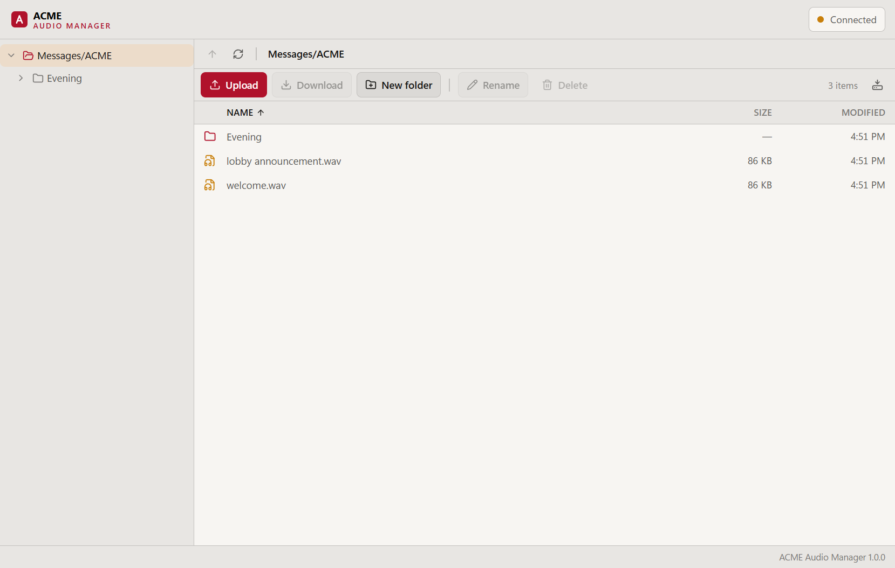

# Q-SYS Media Browser

A desktop file browser for a Q-SYS Core's `/media` store, built to be stamped
out as a distinct branded application per customer.

Each build opens straight into one folder on one Core — no login screen, no
setup, no way to wander somewhere it should not. The Core address, credentials,
confined folder, feature set, logo and colour palette all come from a single
JSON file at build time.

| `demo` — dark, unjailed | `acme` — light, confined to `Messages/ACME` |
|---|---|
|  |  |

Both are the same code; only `branding/<slug>.json` differs.

## What it does

- Browse, upload, download, create, rename, move and delete
- Drag files in from the desktop to upload; drag rows onto folders to move
- Streaming transfers with real byte progress and cancellation — a 2 GB WAV is
  never held in memory
- Audio preview with seeking, played through an authenticated proxy so the
  renderer never holds a token
- Core media playlists: create, reorder, add and remove
- Read-only default folders (`Audio`, `Messages`, …) marked and protected
- Works against Cores with Access Control on (`protected`) or off (`open`)

## Quick start

```bash
npm install
npm run setup:demo       # writes the demo build's credential sidecar

npm run mock-core        # a fake Core on https://127.0.0.1:8443
npm run dev              # the app, pointed at it
```

`setup:demo` exists because credentials are gitignored (see below), so a fresh
clone has none. The demo build targets the local mock Core, whose login is a
default published in `scripts/mock-core.ts` — a fixture, not a secret — so the
script can simply generate it.

The mock reproduces the real API — including its awkward parts — so the whole
app can be developed and tested with no hardware. See
[docs/API-NOTES.md](docs/API-NOTES.md).

```bash
QSYS_CUSTOMER=acme npm run dev   # a different customer's branding
npm test                          # 143 tests, no hardware or secrets needed
npm run typecheck
```

## Building for a customer

```bash
npm run build:customer acme
npm run build:all
```

Artifacts land in `dist/<slug>/`. Full walkthrough:
[docs/CUSTOMER_BUILDS.md](docs/CUSTOMER_BUILDS.md).

Two sample configs ship with the repo — `demo` (dark, unjailed, playlists on)
and `acme` (light, confined to `Messages/ACME`, playlists off) — which between
them exercise every branding dimension.

## Read this before shipping

**Credentials are never committed.** Customer configs live in git; their
passwords live in gitignored `branding/<slug>.secret.json` sidecars, and the
schema rejects an inline `credentials` block so this cannot regress. Copy
`branding/_template.secret.example.json` to get started. CI reads
`QSYS_CRED_<SLUG>_USERNAME` / `_PASSWORD` instead.

**Credentials compiled into the binary are still recoverable** by anyone willing
to unpack it. This build encrypts them, keeps them out of the renderer, and
binds them to the build — but the key ships alongside the ciphertext, so treat
every shipped credential as eventually public and **give each customer build its
own Core user scoped to its own folder**.

[docs/SECURITY.md](docs/SECURITY.md) covers this, the folder jail, and the
renderer sandbox.

## Layout

```
branding/            one JSON + logo + icon per customer
  _schema.ts         the config schema; single source of truth
  *.secret.json      credentials, gitignored - never committed
scripts/
  build-customer.ts  validate -> icons -> bundle -> leak-check -> package
  mock-core.ts       a local stand-in for a Core's API
  drive.mjs          Playwright REPL for driving the built app headlessly
src/
  main/              all Core communication lives here
    qsys/paths.ts    the folder jail - the security-critical module
    qsys/client.ts   HTTPS transport: Host header, TLS pinning, 401 retry
    qsys/transfer.ts streaming upload/download queue
    protocol.ts      qsys-media:// authenticated audio proxy
  preload/           the entire renderer capability surface
  renderer/          React UI
  shared/            types, IPC contract, path helpers, theme derivation
tests/               jail, integration, cancellation, branding, open-mode
```

The renderer is treated as untrusted: sandboxed, context-isolated, no Node, and
reaching the Core only through the channels in `src/shared/ipc.ts`. It never
learns the Core's address.

## Architecture notes

**Why the jail is one module.** All path translation goes through `PathJail`,
and every IPC handler funnels its arguments through it. Confinement is a
property of the main process, not of which buttons the UI renders — so a
scripted call from devtools gains nothing.

**Why theme colours are derived, not listed.** A customer supplies two or three
hex values; the ~25 the UI needs are computed in OKLCH so the steps are
perceptually even at any hue. Foregrounds are computed to clear WCAG AA rather
than guessed, and the build fails on pairings that cannot be made legible
without changing the brand colours themselves.

**Why transfers are hand-rolled.** Node's `https` directly, with a hand-built
multipart body, is what buys byte-level progress and mid-flight cancellation on
files that routinely run to hundreds of megabytes.

**Why there is a mock Core.** Uploads, range-seeking playback, `Host`-header
enforcement and read-only folders are all things you cannot test by reading the
docs. The mock was built before the UI, and every API quirk in
[docs/API-NOTES.md](docs/API-NOTES.md) has a test behind it.

## Known limitations

- **macOS and Linux artifacts need their own CI runner.** electron-builder
  cannot cross-build a notarized `.dmg`, and AppImage needs Linux. All three
  targets are configured; `.github/workflows/release.yml` builds them.
- **Builds are unsigned.** SmartScreen warns on first Windows run until a
  code-signing certificate is added.
- **Move semantics are unverified on real hardware.** Rename turned out to take
  a filename *stem* rather than a full name (fixed, and tested); `PUT` takes a
  full path in a different field so it most likely differs, but confirm it. See
  [docs/API-NOTES.md](docs/API-NOTES.md#rename-takes-the-stem-not-the-filename).
- **Chromium cannot decode every format a Core will store.** AIFF in particular
  fails; the player says so and suggests downloading instead.
